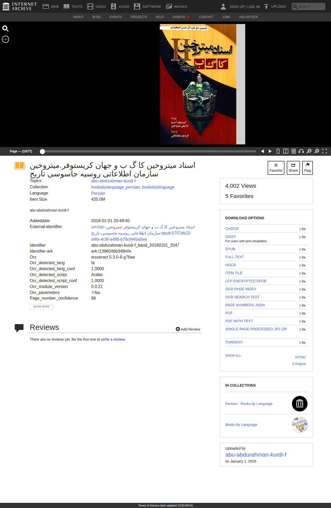

# Visited: https://archive.org/details/abu-abdurahman-kurdi-f_barid_20180101_2047
**Time:** Tue May  5 15:57:35 UTC 2026

## Screenshot

## Raw HTML
[page.html](./page.html)

## Downloaded Media (1 files)
## Downloaded Media Files

## Other Links
- [#](#)
- [#maincontent](#maincontent)
- [#path-1](#path-1)
- [/](/)
- [//archive.org/components/npm/@webcomponents/webcomponentsjs/webcomponents-bundle.js?v=4b6bc904](//archive.org/components/npm/@webcomponents/webcomponentsjs/webcomponents-bundle.js?v=4b6bc904)
- [//archive.org/components/npm/lit/polyfill-support.js?v=4b6bc904](//archive.org/components/npm/lit/polyfill-support.js?v=4b6bc904)
- [//archive.org/includes/apollo.js?v=4b6bc904](//archive.org/includes/apollo.js?v=4b6bc904)
- [//archive.org/includes/athena.js?v=4b6bc904](//archive.org/includes/athena.js?v=4b6bc904)
- [//archive.org/includes/build/css/archive.min.css?v=4b6bc904](//archive.org/includes/build/css/archive.min.css?v=4b6bc904)
- [//archive.org/includes/build/js/details-bookreader.min.js?v=4b6bc904](//archive.org/includes/build/js/details-bookreader.min.js?v=4b6bc904)
- [//archive.org/includes/build/js/ia-sentry.min.js?v=4b6bc904](//archive.org/includes/build/js/ia-sentry.min.js?v=4b6bc904)
- [//archive.org/includes/build/js/ia-topnav.min.js?v=4b6bc904](//archive.org/includes/build/js/ia-topnav.min.js?v=4b6bc904)
- [//athena.archive.org/0.gif?kind=track_js&track_js_case=control&cache_bust=289325126](//athena.archive.org/0.gif?kind=track_js&track_js_case=control&cache_bust=289325126)
- [//athena.archive.org/0.gif?kind=track_js&track_js_case=disabled&cache_bust=924633965](//athena.archive.org/0.gif?kind=track_js&track_js_case=disabled&cache_bust=924633965)
- [/about/](/about/)
- [/about/contact](/about/contact)
- [/about/faqs.php](/about/faqs.php)
- [/about/jobs](/about/jobs)
- [/about/terms](/about/terms)
- [/about/volunteer-positions](/about/volunteer-positions)
- [/account/login](/account/login)
- [/account/signup](/account/signup)
- [/advancedsearch.php](/advancedsearch.php)
- [/bookreader/BookReader-ia.css?v=4b6bc904](/bookreader/BookReader-ia.css?v=4b6bc904)
- [/compress/abu-abdurahman-kurdi-f_barid_20180101_2047](/compress/abu-abdurahman-kurdi-f_barid_20180101_2047)
- [/compress/abu-abdurahman-kurdi-f_barid_20180101_2047/formats=ITEM TILE,ARCHIVE BITTORRENT,METADATA,IMAGE CONTAINER PDF](/compress/abu-abdurahman-kurdi-f_barid_20180101_2047/formats=ITEM TILE,ARCHIVE BITTORRENT,METADATA,IMAGE CONTAINER PDF)
- [/details/78rpm](/details/78rpm)
- [/details/911](/details/911)
- [/details/@abu-abdurahman-kurdi-f](/details/@abu-abdurahman-kurdi-f)
- [/details/GratefulDead](/details/GratefulDead)
- [/details/abu-abdurahman-kurdi-f_barid_20180101_2047/%D8%A7%D8%B3%D9%86%D8%A7%D8%AF%20%D9%85%DB%8C%D8%AA%D8%B1%D9%88%D8%AE%DB%8C%D9%86%20%DA%A9%D8%A7%20%DA%AF%20%D8%A8%20%D9%88%20%D8%AC%D9%87%D8%A7%D9%86-%DA%A9%D8%B1%DB%8C%D8%B3%D8%AA%D9%88%D9%81%D8%B1.%D9%85%DB%8C%D8%AA%D8%B1%D9%88%D8%AE%DB%8C%D9%86-%D8%B3%D8%A7%D8%B2%D9%85%D8%A7%D9%86%20%D8%A7%D8%B7%D9%84%D8%A7%D8%B9%D8%A7%D8%AA%DB%8C%20%D8%B1%D9%88%D8%B3%DB%8C%D9%87-%D8%AC%D8%A7%D8%B3%D9%88%D8%B3%DB%8C-%D8%AA%D8%A7%D8%B1%DB%8C%D8%AE](/details/abu-abdurahman-kurdi-f_barid_20180101_2047/%D8%A7%D8%B3%D9%86%D8%A7%D8%AF%20%D9%85%DB%8C%D8%AA%D8%B1%D9%88%D8%AE%DB%8C%D9%86%20%DA%A9%D8%A7%20%DA%AF%20%D8%A8%20%D9%88%20%D8%AC%D9%87%D8%A7%D9%86-%DA%A9%D8%B1%DB%8C%D8%B3%D8%AA%D9%88%D9%81%D8%B1.%D9%85%DB%8C%D8%AA%D8%B1%D9%88%D8%AE%DB%8C%D9%86-%D8%B3%D8%A7%D8%B2%D9%85%D8%A7%D9%86%20%D8%A7%D8%B7%D9%84%D8%A7%D8%B9%D8%A7%D8%AA%DB%8C%20%D8%B1%D9%88%D8%B3%DB%8C%D9%87-%D8%AC%D8%A7%D8%B3%D9%88%D8%B3%DB%8C-%D8%AA%D8%A7%D8%B1%DB%8C%D8%AE)
- [/details/americana](/details/americana)
- [/details/amesresearchcenterimagelibrary](/details/amesresearchcenterimagelibrary)
- [/details/animationandcartoons](/details/animationandcartoons)
- [/details/apkarchive](/details/apkarchive)
- [/details/artsandmusicvideos](/details/artsandmusicvideos)
- [/details/audio](/details/audio)
- [/details/audio_bookspoetry](/details/audio_bookspoetry)
- [/details/audio_music](/details/audio_music)
- [/details/audio_news](/details/audio_news)
- [/details/audio_religion](/details/audio_religion)
- [/details/audio_tech](/details/audio_tech)
- [/details/biodiversity](/details/biodiversity)
- [/details/booksbylanguage](/details/booksbylanguage)
- [/details/booksbylanguage_persian](/details/booksbylanguage_persian)
- [/details/cd-roms](/details/cd-roms)
- [/details/cdbbsarchive](/details/cdbbsarchive)
- [/details/cdromimages](/details/cdromimages)
- [/details/cdromsoftware](/details/cdromsoftware)
- [/details/classicpcgames](/details/classicpcgames)

## Stats
- Links: 173
- Media: 1
